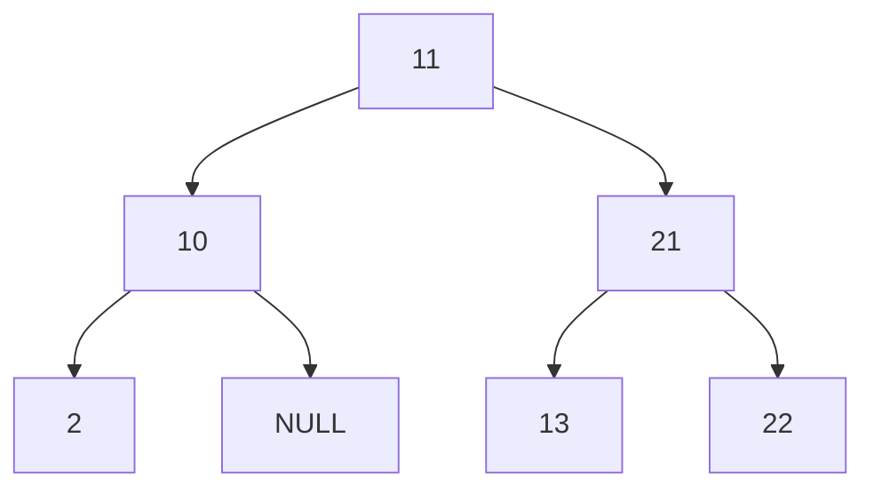

```mermaid
graph

11 --> 10
11 --> 21
10 --> 2
10 --> NULL
21 --> 13
21 --> 22


```

Resultado de ingresar las siguientes claves: 7, 11, 10, 2, 22, 8, 4, 21, 13.

Y a continuacion eliminar: 8, 4, 7.

Rotaciones realizadas: RID, RID, RDI
