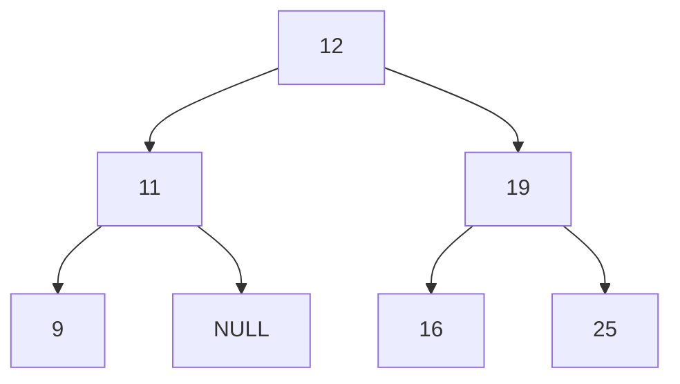

```mermaid
graph

12 --> 11
12 --> 19
11 --> 9
11 --> NULL
19 --> 16
19 --> 25


```

Resultado de ingresar las siguientes claves: 15, 11, 12, 9, 19, 10, 14, 16 y 25.

Y a continuacion eliminar: 14, 15 y 10.

Rotaciones realizadas: RDI, RDD
